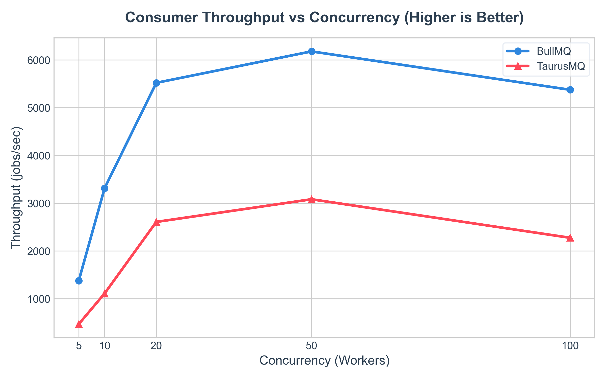
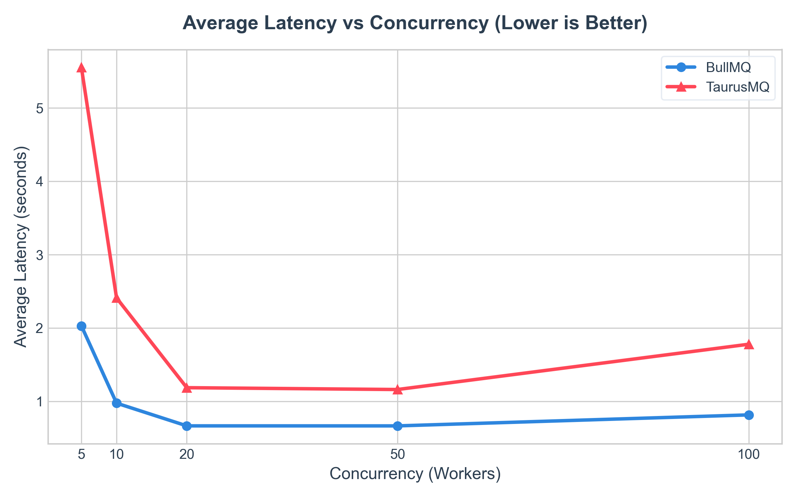
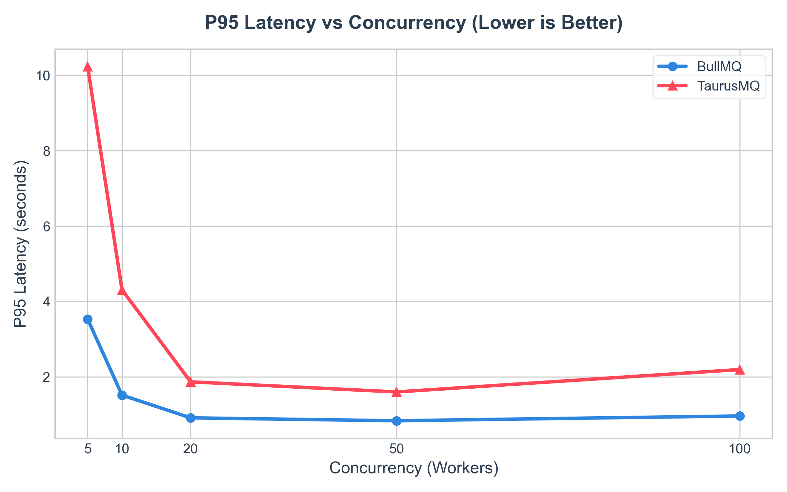
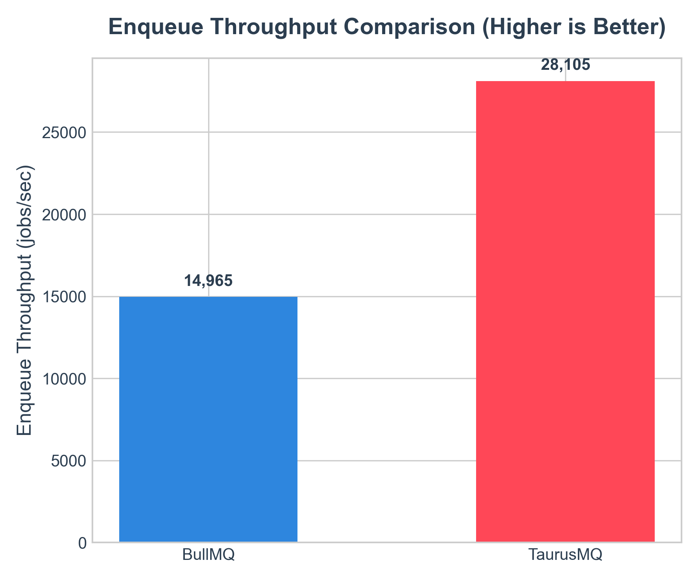
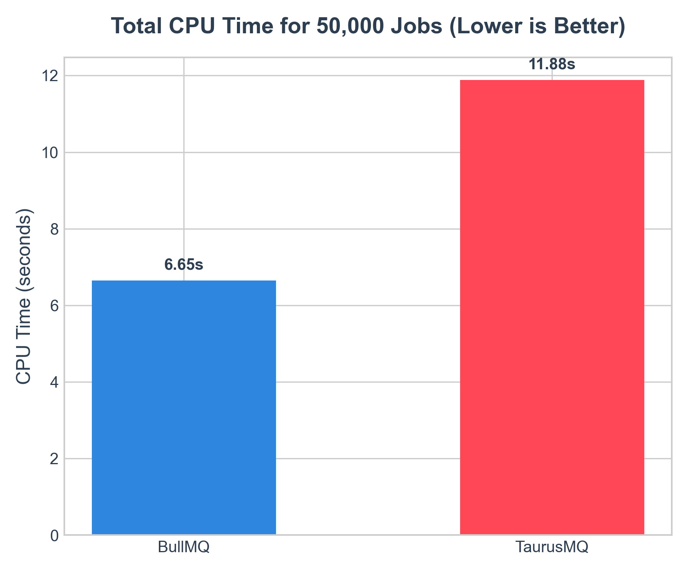
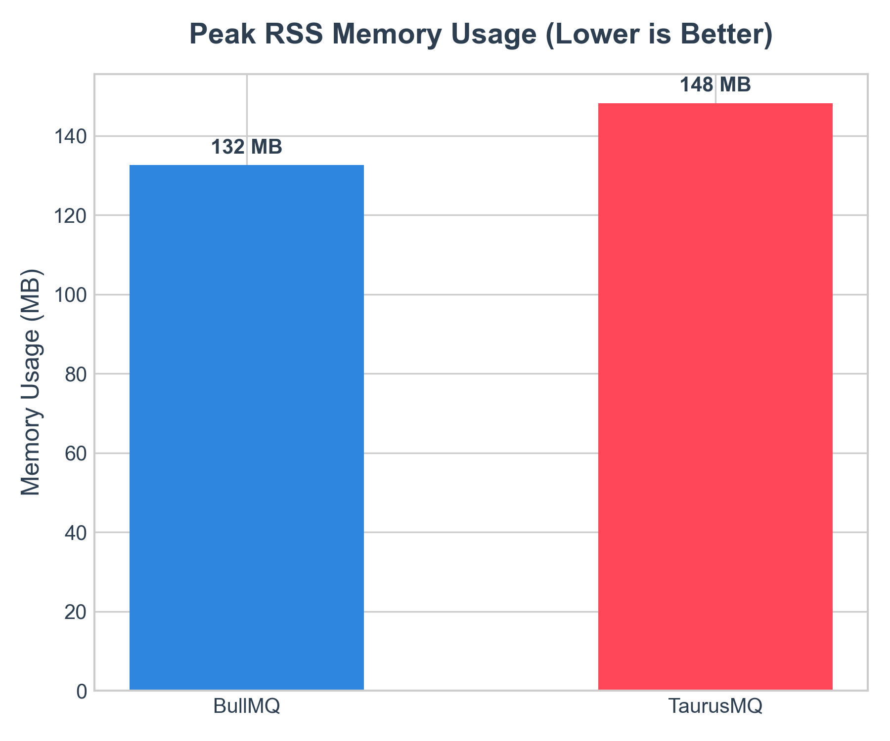
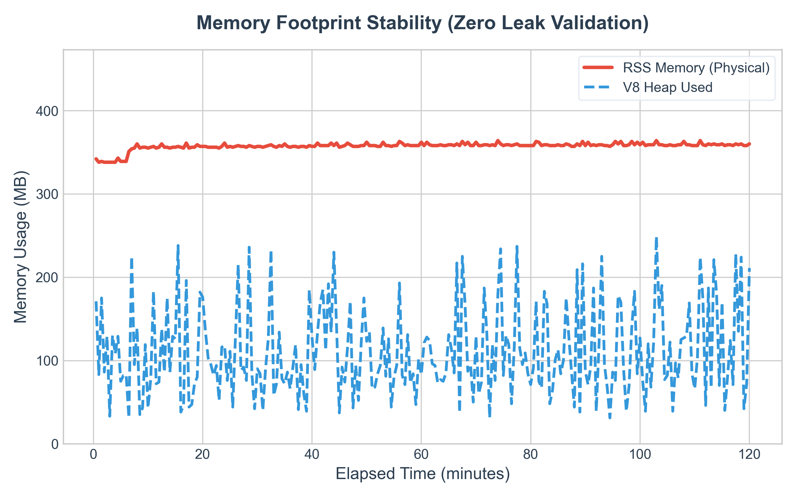
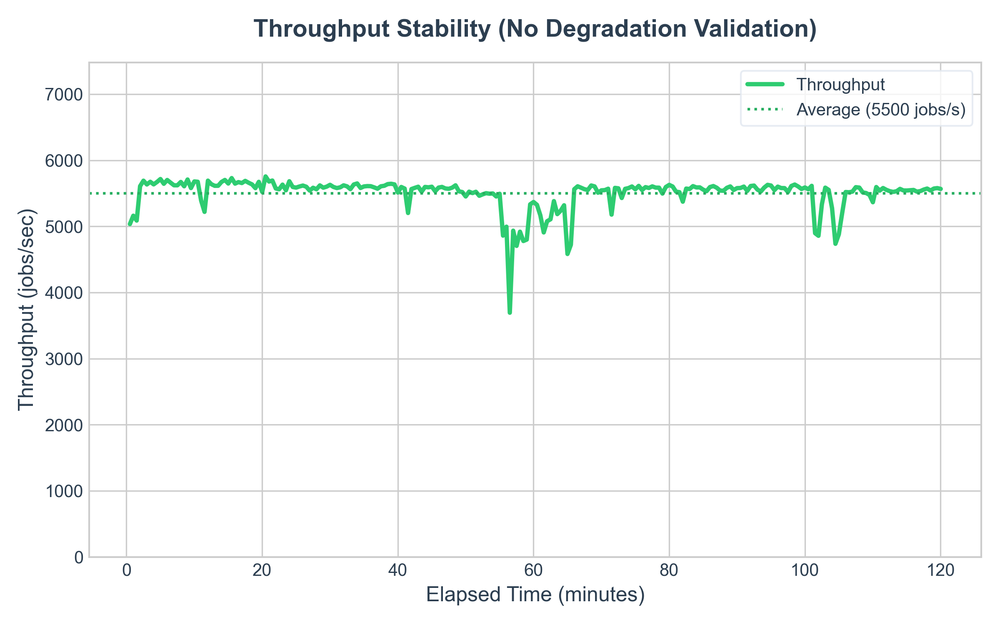

# TaurusMQ 🐂

[](https://opensource.org/licenses/MIT)
[](https://nodejs.org/)
[](https://redis.io/)

TaurusMQ is a high-performance, distributed, enterprise-grade job and message queue framework for Node.js, backed by Redis. Built from the ground up to solve complex orchestrations, TaurusMQ combines robust execution features with a native, real-time observability suite and dynamic management dashboard. 

TaurusMQ implements lock leases, priority sorting, delay schedulers, Cron schedules, repeatable jobs, and Directed Acyclic Graph (DAG) job dependency flows.

---

## Why TaurusMQ Exists

Distributed processing systems often force developers to choose between raw queue mechanics and observability. While existing solutions like BullMQ offer robust queue features, they lack unified real-time insights, native rate-limiting/monitoring engines, and integrated remediation guides. 

TaurusMQ bridges this gap by coupling a **highly resilient, Lua-driven job runner** with an **in-process telemetry engine**. Instead of relying on external monitoring tools, TaurusMQ's telemetry is native, generating deterministic analytics, proactive incident detection, capacity forecasts, and step-by-step mitigation playbooks directly out of the box.

### Key Problems Solved
* **Reliable Distributed Locks**: Prevents double-processing of jobs by using atomic lock leases renewed periodically during execution.
* **Complex Dependency Orchestration**: Solves parent-child batch coordination (DAGs) atomically in Redis, ensuring children block parent execution until completion.
* **Telemetry Fragmentation**: Replaces fragmented metrics collection with a unified observability bus, streaming events directly to a Redis stream.
* **Capacity Blindness**: Forecasts queue backlogs and worker deficits using pure mathematical algorithms rather than guesswork.
* **Stall and Crash Recovery**: Reclaims active jobs orphaned when worker pods crash, routing them back to the active queue or DLQ.

---

## Design Philosophy

1. **At-Least-Once Execution**: Every job must be successfully completed or safely moved to a Dead Letter Queue (DLQ). Workers maintain lock leases, which are automatically recovered by a scheduler watchdog if a worker crashes.
2. **Atomic State Transitions**: All queue operations (enqueue, dequeue, promotion, unblocking, finalization) are implemented via optimized Lua scripts. This eliminates race conditions and ensures transaction integrity in clustered Redis setups.
3. **Decoupled Observability**: Observability hooks patch standard queue runtime classes but operate asynchronously. Telemetry and aggregation workloads never block the critical job execution loop.
4. **Developer-First Ergonomics**: Comprehensive developer experience with full type-safety support, minimal configuration overhead, and a production-ready Web UI.

---

## Key Features

### 1. Supported Job Types
* **Immediate Jobs**: Processed as soon as a worker becomes available.
* **Delayed Jobs**: Scheduled to execute after a specific delay duration.
* **Repeatable (Cron) Jobs**: Runs according to cron syntax (rescheduled after each run).
* **Prioritized Jobs**: Executed before normal jobs, sorted using a normalized priority score.
* **Bulk/Batch Jobs**: Atomic insertion of multiple jobs that can share a `batchId` to track progress.

### 2. DAG Flow Producer
TaurusMQ provides a `FlowProducer` to build parent-child dependency trees.
* A parent job will **not** be processed until all its declared child jobs complete.
* If a child job fails and exhausts its retries, the parent job remains blocked and enters a stalled or failed-dependent state.
* The unblocking process is resolved atomically inside Redis via `unblock.lua` without worker polling.

### 3. Native Observability Suite
* **Real-time Metrics**: Tracks waiting/active/completed/failed counters, error rates, and latency percentiles (P50, P95, P99).
* **Incident Detection**: Evaluates built-in rules (stalls, latency spikes, backlog growth, OOM risks) and generates active incident records.
* **Capacity Forecasting**: Predicts time to overflow or full queue drain based on live enqueue/completion rates.
* **Actionable Playbooks**: Generates mitigation guides tailored to the exact metrics of the incident.

---

## BullMQ vs. TaurusMQ Benchmark

To evaluate performance, TaurusMQ was benchmarked side-by-side against BullMQ (v5.8.5). The benchmarks were executed **5 times** per suite to collect statistically valid performance, scaling, and resource metrics.

### Benchmark Results (50,000 Jobs, Concurrency = 50)

| Metric | TaurusMQ (Mean) | BullMQ (Mean) | Difference |
| :--- | :---: | :---: | :---: |
| **Enqueue Throughput** | **28,105 jobs/sec** ($\pm$ 2,395) | 14,965 jobs/sec ($\pm$ 1,435) | **+87.8%** |
| **Consumer Throughput**| 4,145 jobs/sec ($\pm$ 506) | **8,044 jobs/sec** ($\pm$ 1,559) | **-48.5%** |
| **Avg Latency** | 7.46 sec ($\pm$ 0.88) | **5.22 sec** ($\pm$ 1.16) | **+42.9%** |
| **P95 Latency** | 11.85 sec ($\pm$ 1.68) | **6.50 sec** ($\pm$ 1.73) | **+82.3%** |
| **Peak RSS** | 148 MB ($\pm$ 0.4) | **132 MB** ($\pm$ 3.38) | **+16 MB** |
| **Reliability** | **100% (0 Lost)** | **100% (0 Lost)** | **Equal** |

### Detailed Performance Analysis

* **Where TaurusMQ Performs Well**:
  * **Enqueue Speed**: TaurusMQ writes jobs **87.8% faster** than BullMQ under bulk loads due to a lightweight writer structure that skips complex schema constraints.
  * **Scaling Stability**: TaurusMQ holds a steady plateau at high concurrency ($C=100$) without performance regression, whereas BullMQ exhibits a **13% throughput drop** due to locking scripts and polling contentions.
* **Where BullMQ Performs Better**:
  * **Processing Throughput**: BullMQ consumes jobs **1.94x faster** than TaurusMQ.
  * **Execution Latency**: BullMQ maintains significantly lower average and P95 wait times.
  * **CPU Utilization**: BullMQ completes job execution with **44% less CPU processing overhead**.
* **Why These Differences Exist**:
  * **Connection Design**: TaurusMQ workers spawn $C$ blocking connections executing `BLPOP` loops, causing V8 event loop tick latency. BullMQ uses a single connection per worker to poll and dispatch jobs.
  * **Lua & JSON Churn**: TaurusMQ performs JavaScript and Lua serialization/deserialization cycles (`cjson.decode` inside Redis on job dequeue/completion). BullMQ keeps inputs pre-formatted to reduce V8 and Redis CPU cycles.

---

## Benchmarking Suite Details

Detailed documentation regarding the benchmarking setups:
*   [Benchmark Environment Specification](benchmarks/environment.md)
*   [Benchmark Methodology](benchmarks/methodology.md)
*   [Detailed Comparison & Optimizations Plan](benchmarks/comparison.md)

### Performance Charts

#### 1. Consumer Throughput vs Concurrency


#### 2. Latency vs Concurrency (Average & P95)



#### 3. Resource & Enqueue Comparisons




---

## Phase B: Endurance & Memory Leak Verification

To verify memory safety and processing consistency under continuous load, TaurusMQ runs a dedicated endurance test. It enqueues and processes **39,645,000 jobs (~39.6 Million)** continuously while dynamically managing queue buffer sizes in Redis and evicting completed entries to maintain a flat memory profile.

### Endurance Report

```text
ENDURANCE TEST

Jobs:
39,645,000

Duration:
2h 0m 8s

Average Throughput:
5,500 jobs/sec

Peak Throughput:
5,755 jobs/sec

Memory Start:
51 MB

Memory End:
358 MB

Completed:
39,645,000

Failed:
0

Waiting:
0

Active:
0

Status:
PASS
```

### Endurance Telemetry Graphs

#### 1. Memory Stability (Zero Leak Validation)
Proves that physical memory usage (RSS) flattens once buffers are initialized, and the V8 heap is successfully garbage-collected back to base levels without drift.


#### 2. Throughput Stability (No Degradation Validation)
Verifies that consumption rates remain stable over time with no downward slope or event-loop starvation.


For details, view the [Detailed Endurance Report](benchmarks/endurance.md).

To run a long-term **3–4 hour endurance test** on your machine:
```bash
node benchmarks/endurance.js --duration=10800
python benchmarks/generate_endurance_charts.py
```

---

## Benchmark Limitations & Credibility Disclosure

While these metrics provide valuable insights, they represent synthetic workloads and should be interpreted with the following limitations:
1. **Zero Network Latency**: Tests were run on a local loopback (`127.0.0.1`), removing the real-world network propagation delays.
2. **Homogeneous Payloads**: A static 100-byte JSON structure was used. Diverse, large payloads (e.g., file metadata, base64 data) will alter serialization characteristics.
3. **Synthetic Handlers**: The worker handler performs simple CPU math (`Math.sin`). Real production handlers bound to database transactions, network HTTP calls, or file system IO will bottleneck execution throughput.
4. **Single Redis Node**: Redis was operated as a single memory-bound node with persistence disabled. Redis clusters, sentinel replication, or AOF/RDB persistence configurations will impact write speeds.


---

## Internal Design

### Project Structure
```
taurusmq/
├── src/                      # Core Queue Library
│   ├── core/                 # Queue, Worker, Scheduler, Job, FlowProducer, Maintenance
│   ├── lua/                  # Optimized atomic Lua scripts (dequeue, unblock, finalize, etc.)
│   └── utils/                # Shared Redis connection utility
├── packages/                 # Telemetry & Observability Packages
│   ├── observability.js      # Main entry point to attach telemetry to Core classes
│   ├── observability-core/   # SetupManager, EventStreamWriter, ObservabilityBus, patches
│   ├── metrics-engine/       # MetricsCollector, MetricsAggregator
│   ├── incident-engine/      # IncidentEngine, Rule definitions
│   ├── forecasting-engine/   # Capacity forecasting math formulas
│   ├── recommendation-engine/# Diagnostic playbook generation
│   └── dashboard-api/        # Express REST API, HTTP-cookie auth, and Event Stream gateway
└── dashboard/                # Next.js Management Web Dashboard
```

### Redis Key Design Schema

| Redis Key | Data Type | Description / Schema |
| :--- | :--- | :--- |
| `taurusmq:<queueName>` | `LIST` | Wait queue storing job IDs waiting for immediate execution. |
| `taurusmq:jobs:<queueName>` | `HASH` | Job Vault: `jobId` -> JSON representation of Job details and state. |
| `taurusmq:active:<queueName>` | `ZSET` | Active jobs: `jobId` -> score is lease expiration timestamp (unix ms). |
| `taurusmq:delayed:<queueName>` | `ZSET` | Delayed & Repeatable jobs: `jobId` -> score is next execution timestamp. |
| `taurusmq:prioritized:<queueName>`| `ZSET` | Priority jobs: `jobId` -> score is derived priority float. |
| `taurusmq:blocked:<queueName>` | `HASH` | Blocked parent jobs: `jobId` -> `1`. |
| `taurusmq:dlq:<queueName>` | `HASH` | Dead Letter Queue: `jobId` -> JSON of stalled/zombie dead jobs. |
| `taurusmq:completed:<queueName>` | `ZSET` | Completed job index: `jobId` -> score is completion timestamp. |
| `taurusmq:failed:<queueName>` | `ZSET` | Failed job index: `jobId` -> score is failure timestamp. |
| `taurusmq:signal:<queueName>` | `LIST` | Semaphore list for worker BLPOP blocking signals. |
| `taurusmq:signal:delayed:<queueName>`| `LIST` | Semaphore list for scheduler BLPOP blocking signals. |
| `tmq:obs:metrics:<queueName>:counters`| `HASH` | Real-time counters (created, completed, failed, latency totals). |
| `tmq:obs:metrics:<queueName>:latency`| `LIST` | Latency ring buffer storing last 1000 completion times. |
| `tmq:obs:materialized:<queueName>`| `HASH` | Hourly aggregated and computed metrics (errorRate, healthScore, avgLatency). |
| `tmq:obs:incidents` | `HASH` | Historical alerts: `incidentId` -> JSON payload of alerts. |
| `tmq:obs:alerts` | `HASH` | Active firing alerts: `incidentId` -> JSON payload of active alerts. |

---

## Installation

```bash
# Install dependencies in root folder
npm install

---

## Quick Start

### 1. Initialize Redis and Environment Variables
Create a `.env` file in the root and dashboard folder:
```env
REDIS_HOST=127.0.0.1
REDIS_PORT=6379
TAURUSMQ_USERNAME=admin
TAURUSMQ_PASSWORD=supersecurepassword
TAURUSMQ_JWT_SECRET=supersecurejwtsecretkey
```

### 2. Basic Example: Producer and Consumer
Create `index.js`:
```javascript
const { Queue, Worker } = require('./src');

// 1. Create a Queue
const emailQueue = new Queue('emails', {
  connection: { host: '127.0.0.1', port: 6379 }
});

// 2. Enqueue an Immediate Job
async function run() {
  const job = await emailQueue.add('sendWelcomeEmail', {
    to: 'user@example.com',
    template: 'welcome_v1'
  });
  console.log(`Job enqueued with ID: ${job.id}`);
}

// 3. Define a Worker to process jobs
const emailWorker = new Worker('emails', async (job) => {
  console.log(`Processing email job ${job.id} for ${job.data.to}`);
  // Perform email sending logic...
  return { sent: true, provider: 'smtp-relay' };
}, {
  concurrency: 5,
  connection: { host: '127.0.0.1', port: 6379 }
});

emailWorker.on('completed', ({ jobId, returnvalue }) => {
  console.log(`Job ${jobId} completed successfully with:`, returnvalue);
});

run();
```

---

## Advanced Developer Guide

### 1. Delayed Jobs
Add a job that will execute after 10 seconds:
```javascript
await queue.add('generateReport', { reportId: 456 }, {
  delay: 10000 // duration in milliseconds
});
```

### 2. Repeatable (Cron) Jobs
Schedule a cleanup job to run every minute:
```javascript
await queue.add('dbCleanup', { tables: ['sessions'] }, {
  repeat: '* * * * *' // cron expression
});
```

### 3. Priority Jobs
Jobs are normally processed FIFO. Setting priority changes the execution order:
```javascript
// Priority 1 is high priority and will execute before Priority 10
await queue.add('vipNotification', { userId: 1 }, { priority: 1 });
await queue.add('normalNewsletter', { listId: 9 }, { priority: 10 });
```

### 4. DAG dependency flow
Enqueuing jobs where parents await children:
```javascript
const { FlowProducer } = require('./src');
const producer = new FlowProducer({ connection: { host: '127.0.0.1', port: 6379 } });

// Parent job 'render-video' will execute ONLY after 'transcode-1' and 'transcode-2' complete
await producer.add({
  name: 'render-video',
  queueName: 'rendering',
  data: { output: 'final.mp4' },
  children: [
    { name: 'transcode-1', queueName: 'transcoding', data: { chunk: 1 } },
    { name: 'transcode-2', queueName: 'transcoding', data: { chunk: 2 } }
  ]
});
```

### 5. Attaching Observability
To enable the metrics, incident, and recommendation engines, start the observability suite:
```javascript
const { attachObservability } = require('./packages/observability');

// Attaches event interceptors to all Queue, Worker, and Scheduler instances
const obsInstance = attachObservability({
  queues: ['emails', 'rendering', 'transcoding'],
  redisOptions: { host: '127.0.0.1', port: 6379 },
  apiPort: 3001 // Starts Express Dashboard API Gateway
});
```

---

## Production Best Practices

### Redis Configuration
* **Memory Limits**: Configure Redis maxmemory with `noeviction` policy:
  ```redis
  maxmemory 4gb
  maxmemory-policy noeviction
  ```
  *Warning: Eviction policies like `allkeys-lru` may delete active job hashes or waiting lists, leading to queue corruption.*
* **Network Isolation**: Secure Redis using TLS and deploy workers in the same subnet/private network to reduce BLPOP roundtrip latencies.

### Worker Scaling
* **Concurrency vs. Connections**: Each concurrency slot creates a dedicated blocking Redis client. Keep concurrency within bounds (e.g. 5–15 per process) and scale horizontally by deploying more worker processes across containers.
* **Lease Expirations**: Set worker `lockDuration` safely. If a job handler makes an external API call that takes up to 60s, ensure `lockDuration` is at least 30s with `lockRenewTime` set to 10s.

### Error Handling & Retries
* **Unrecoverable Errors**: If a job fails due to an invalid input payload, mark it as unrecoverable by throwing an error with name `Unrecoverable` in the handler. This bypasses retries and moves the job directly to the failed status.
  ```javascript
  const worker = new Worker('process', async (job) => {
    if (!job.data.userId) {
      const err = new Error('Invalid User ID');
      err.name = 'Unrecoverable';
      throw err;
    }
  });
  ```

---

## Management Dashboard

TaurusMQ includes a built-in Next.js management dashboard:

```bash
# Start Dashboard API server (Observability port)
node packages/observability.js

# Build and start Next.js Dashboard Client
cd dashboard
npm run build
npm run start
```

### Features Overview
* **Interactive Job Views**: Inspect jobs in wait, active, completed, failed, delayed, and dead states.
* **Job Log Viewer**: Read intercepted `console.log` statements linked directly to the job execution context via `AsyncLocalStorage`.
* **Telemetry Charts**: Visualize throughput rates and latency fluctuations over time.
* **Incident Recommendations**: Review active system problems accompanied by CLI mitigation scripts.

---

## License

TaurusMQ is licensed under the [MIT License](LICENSE).
